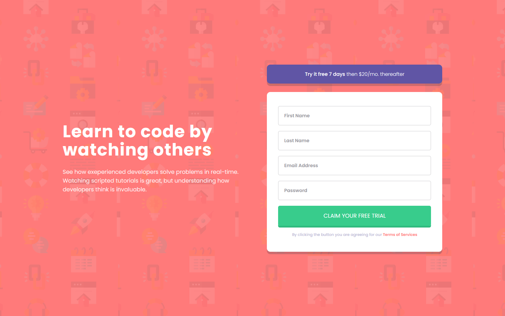

# Frontend Mentor - Intro component with sign up form solution

This is a solution to the [Intro component with sign up form challenge on Frontend Mentor](https://www.frontendmentor.io/challenges/intro-component-with-signup-form-5cf91bd49edda32581d28fd1). Frontend Mentor challenges help you improve your coding skills by building realistic projects.

## Table of contents

- [Overview](#overview)
  - [The challenge](#the-challenge)
  - [Screenshot](#screenshot)
  - [Links](#links)
- [My process](#my-process)
  - [Built with](#built-with)
  - [What I learned](#what-i-learned)
  - [Continued development](#continued-development)
- [Author](#author)

## Overview

### The challenge

Users should be able to:

- View the optimal layout for the site depending on their device's screen size
- See hover states for all interactive elements on the page
- Receive an error message when the `form` is submitted if:
  - Any `input` field is empty. The message for this error should say _"[Field Name] cannot be empty"_
  - The email address is not formatted correctly (i.e. a correct email address should have this structure: `name@host.tld`). The message for this error should say _"Looks like this is not an email"_

### Screenshot

### Links

- Solution URL: [https://www.frontendmentor.io/solutions/intro-component-with-signup-form-using-css-and-javascript-zKPrh3H_rw](https://www.frontendmentor.io/solutions/intro-component-with-signup-form-using-css-and-javascript-zKPrh3H_rw)
- Live Site URL: [https://intro-component-with-signup-form-ai.netlify.app/](https://intro-component-with-signup-form-ai.netlify.app/)

## My process

### Built with

- Semantic HTML5 markup
- CSS custom properties
- Flexbox
- CSS Grid
- Mobile-first workflow
- JavaScript and Constraint Validation API

### What I learned

By bulding this project I practiced my CSS skills, specifically Flexbox and learned more about Constraint Validation API used 
for client side form validation.

### Continued development

In the future I'd like to learn more about CSS Grid.

### Useful resources

On this MDN [Link](https://developer.mozilla.org/en-US/docs/Learn/Forms/Form_validation) you can learn more about Constraint Validation API 
that I used in this project to implement client-side form validation.

## Author

- Frontend Mentor - [@andrijaivkovic](https://www.frontendmentor.io/profile/andrijaivkovic)
- Twitter - [@AndrijaIvkovic1](https://www.twitter.com/AndrijaIvkovic1)
